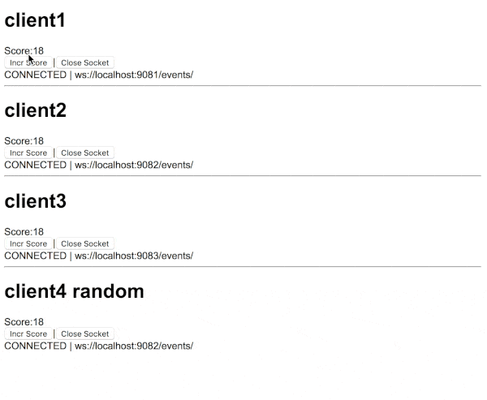

# websocket-failover-example
this is a simple websocket failover example with jetty and hazelcast.

What it does is, you spawn 3 (or more) websocket servers, clients connects to any of them. 

We hold a simple integer and increment when client presses a button. 

Clients can disconnect and reconnect to any of the available websockets, and you can see the counter still has the same value.


What ?
-------------------------



You can see we have 4 clients, connecting to each websocket server. Incrementing the counter on any port is published almost realtime
to other websocket clients.

The 4th client connects to one of the servers randomly.

How it works
-------------------------
- checkout the project
- build with:
```    
    mvn package
```
- on the same terminal, run server 
```
java -jar target/javax.websocket-example-1.0-SNAPSHOT-jar-with-dependencies.jar 9081
```
- on another terminal
```
java -jar target/javax.websocket-example-1.0-SNAPSHOT-jar-with-dependencies.jar 9082
```
- on another terminal
```
java -jar target/javax.websocket-example-1.0-SNAPSHOT-jar-with-dependencies.jar 9083
```

- now you have 3 servers, leave them running

- open chrome and access http://localhost:9081/

- on chrome dev console you'll see a similar ui like the one on the image above

- you can try, disconnecting, reconnecting, killing any of the servers etc. The room/session data is in the grid. 
So unless you kill all servers and restart, your room data will be available.


What now
------------
This is simply a starting point to explore the possibilities using a datagrid with java websockets. 


How it works in detail:
------------------------

Todo: